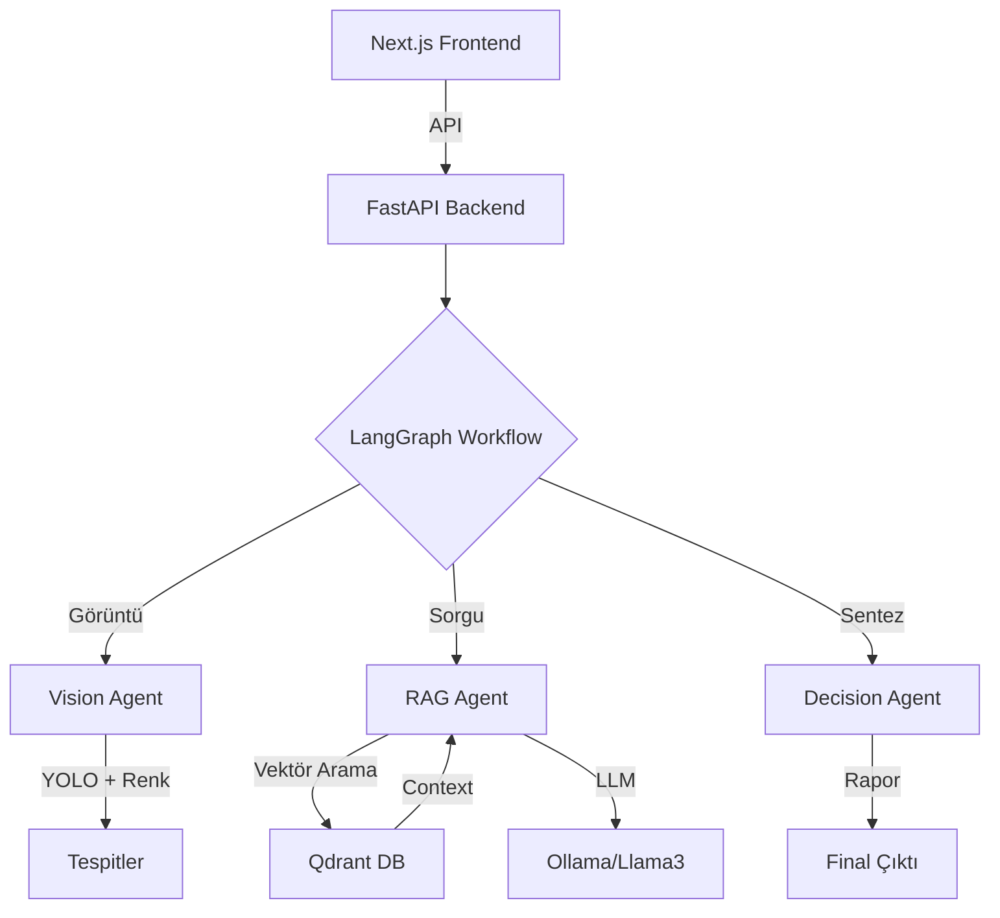

# Future Harvest AI 🌾

**Akıllı, Sürdürülebilir ve Modern Tarım Teknolojisi**

"Future Harvest", topraksız tarım ve geleneksel yetiştiricilik için geliştirilmiş, üretim kalitesini artırmayı hedefleyen profesyonel bir yapay zeka asistanıdır. Bitki hastalıklarını tespit eder, tedavi yöntemleri sunar ve koruyucu tarım stratejileri geliştirir.


## ✨ Temel Özellikler

### 🛡️ Akıllı Teşhis & Güvenlik
- **Plant Validation**: Yüklenen görselin gerçekten bir bitki olup olmadığını kontrol eden ön koruma katmanı.
- **YOLOv8 Vision**: %90+ doğrulukla hastalık tespiti (Erken Yanıklık, Yaprak Lekesi, Kloroz vb.).
- **Renk Analizi**: YOLO'nun kaçırabileceği nüanslar (sararma, kahverengi lekeler) için piksel tabanlı heuristik tarama.

### 📊 Kapsamlı Analiz
- **4 Seviyeli Sağlık Puanı**:
    - 🔴 **0-30**: Kritik (Acil Müdahale)
    - 🟡 **30-60**: Riskli (Dikkat)
    - 🟢 **70-90**: İyi (Koruyucu Bakım)
    - 🌲 **90-100**: Mükemmel
- **Derinlemesine Rapor**: Hastalık Tanımı, Biyolojik Nedenler, Tedavi ve Önleme başlıkları altında akademik detay.

### 🎨 Modern Arayüz (Future Harvest UI)
- **Premium Tasarım**: Zümrüt Yeşili ve Arduvaz Mavisi paleti.
- **Interactive Dashboard**: Cam efektli (Glassmorphism) paneller ve animasyonlu etkileşimler.
- **Mobil Uyumlu**: Sahada tablet veya telefonla kullanım için responsive yapı.

## 🏗️ Mimari



## 🚀 Kurulum

### Gereksinimler
- Docker & Docker Compose
- Ollama (`ollama run llama3.2`)
- Python 3.11+
- Node.js 20+

### Hızlı Başlangıç

1. **Repo'yu Klonlayın**
   ```bash
   git clone https://github.com/saciducak/Topraks-z-Tar-m-icin-production-ready-agent.git
   cd Topraks-z-Tar-m-icin-production-ready-agent
   ```

2. **Backend Başlat**
   ```bash
   make backend
   # veya
   cd backend && python3 -m uvicorn src.main:app --host 0.0.0.0 --port 8001
   ```

3. **Frontend Başlat (Docker)**
   ```bash
   # Mac için
   docker build -t frontend:latest ./frontend
   docker run -d -p 3000:3000 -e API_URL=http://host.docker.internal:8001 frontend:latest
   ```

4. **Tarayıcıda Aç**
   [http://localhost:3000](http://localhost:3000) adresine gidin.

## 📄 Lisans
MIT License - 2025 Future Harvest AI
