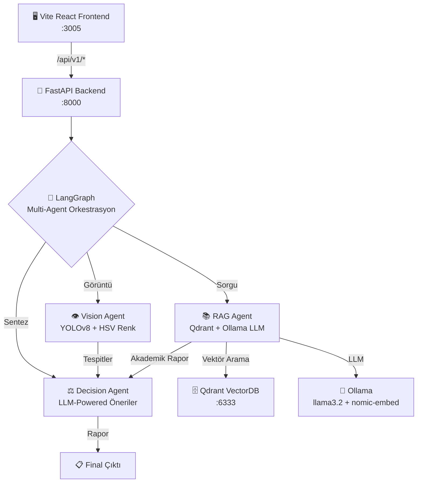

# AgroCortex AI Platform 🌾

**Akıllı, Sürdürülebilir ve Modern Tarım Teknolojisi**

AgroCortex, topraksız tarım ve geleneksel yetiştiricilik için geliştirilmiş, üretim kalitesini artırmayı hedefleyen **production-ready** bir yapay zeka platformudur. Bitki hastalıklarını **YOLOv8** ve **HSV renk analizi** ile tespit eder, **LLM destekli** tedavi planları sunar ve koruyucu tarım stratejileri geliştirir.

## ✨ Temel Özellikler

### 🛡️ Akıllı Teşhis & Güvenlik
- **Plant Validation**: Yüklenen görselin gerçekten bir bitki olup olmadığını kontrol eden ön koruma katmanı.
- **YOLOv8 Vision**: Özel eğitimli model ile domates hastalıklarını tespit (`tomato_disease_yolov8.pt`).
- **HSV Renk Analizi**: YOLO'nun kaçırabileceği nüanslar için piksel tabanlı gelişmiş tarama (5 hastalık türü: Erken Yanıklık, Kloroz, Nekroz, Bakteriyel Leke, Külleme).

### 📊 Kapsamlı Analiz
- **Sağlık Puanı**: Tespitlere göre dinamik skor hesaplama (0-100).
- **Akademik Rapor**: RAG tabanlı, Markdown formatında detaylı analiz.
- **LLM-Powered Tedavi Planı**: Ollama LLM ile sensör verisi + teşhislere göre akıllı öneriler (kimyasal/organik/kültürel kategoriler).

### 🎨 Premium UI (AgroCortex)
- **Glassmorphism Header**: Bulanık cam efekti + canlı sistem durumu göstergesi.
- **Gradient Border Kartlar**: Emerald→Teal→Cyan gradient çerçeveler.
- **Micro-Animations**: Score ring, hover lift, fade-in, pipeline step göstergeleri.
- **Responsive**: Sahada tablet veya telefonla kullanım için mobil uyumlu.

---

## 🏗️ Mimari


```mermaid
graph TD
    A["🖥️ Vite React Frontend<br/>:3005"] -->|"/api/v1/*"| B["📡 FastAPI Backend<br/>:8000"]
    B --> C{"🔄 LangGraph<br/>Multi-Agent Orkestrasyon"}
    C -->|"Görüntü"| D["👁️ Vision Agent<br/>YOLOv8 + HSV Renk"]
    C -->|"Sorgu"| F["📚 RAG Agent<br/>Qdrant + Ollama LLM"]
    C -->|"Sentez"| I["⚖️ Decision Agent<br/>LLM-Powered Öneriler"]
    D -->|"Tespitler"| I
    F -->|"Akademik Rapor"| I
    F -->|"Vektör Arama"| G["🗄️ Qdrant VectorDB<br/>:6333"]
    F -->|"LLM"| H["🦙 Ollama<br/>llama3.2 + nomic-embed"]
    I -->|"Rapor"| J["📋 Final Çıktı"]
```

---

## 🛠️ Teknoloji Stack

| Teknoloji | Versiyon | Rol |
|-----------|---------|-----|
| **FastAPI** | 0.109 | Backend REST API, async request handling |
| **LangGraph** | latest | Multi-agent orkestrasyon, DAG tabanlı workflow |
| **Ollama** | - | Yerel LLM inference (llama3.2 + nomic-embed-text) |
| **Qdrant** | 1.7 | Vektör veritabanı, semantic search |
| **YOLOv8** | 8.1 | Nesne algılama, hastalık tespiti |
| **Vite + React** | 6.x | Modern SPA frontend, HMR |
| **TailwindCSS** | 3.x | Utility-first CSS, responsive design |
| **Docker** | - | Containerization, servis orkestrasyonu |

---

## 🚀 Kurulum & Çalıştırma

### Gereksinimler
- **Docker & Docker Compose**
- **Ollama** (`brew install ollama`)
- Python 3.11+ (yerel geliştirme için)
- Node.js 20+ (yerel geliştirme için)

### 1. Ollama Modellerini Yükle
```bash
ollama pull llama3.2
ollama pull nomic-embed-text
ollama serve  # arka planda çalıştır
```

### 2. Docker ile Tek Komutta Başlat
```bash
git clone https://github.com/saciducak/Topraks-z-Tar-m-icin-production-ready-agent.git
cd Topraks-z-Tar-m-icin-production-ready-agent

docker-compose up --build -d
```

### 3. Tarayıcıda Aç
| Servis | Adres |
|--------|-------|
| 🖥️ Frontend | http://localhost:3005 |
| 📡 Backend API | http://localhost:8000 |
| 📖 Swagger Docs | http://localhost:8000/docs |
| 🗄️ Qdrant Dashboard | http://localhost:6333/dashboard |

### 4. Ollama Durum Kontrolü (Ayrı Terminal)
```bash
# Tek seferlik kontrol
curl -s http://localhost:11434/api/tags | python3 -m json.tool

# Sürekli izleme (her 5 saniyede bir)
watch -n 5 'echo "=== Ollama Status ===" && curl -s -o /dev/null -w "HTTP %{http_code}\n" http://localhost:11434/api/tags && echo "=== Models ===" && curl -s http://localhost:11434/api/tags | python3 -c "import sys,json; [print(f\"  ✅ {m[\"name\"]} ({m[\"details\"][\"parameter_size\"]})\" ) for m in json.load(sys.stdin).get(\"models\",[])]" 2>/dev/null && echo "=== Backend → Ollama ===" && docker exec topraks-z-tar-m-icin-production-ready-agent-backend-1 curl -s -o /dev/null -w "HTTP %{http_code}\n" http://host.docker.internal:11434/api/tags 2>/dev/null'
```

---

## 📁 Proje Yapısı

```
├── backend/
│   ├── src/
│   │   ├── agents/           # LangGraph Agent'ları
│   │   │   ├── graph.py      # DAG workflow tanımı
│   │   │   ├── vision_agent.py   # Görüntü analizi (YOLO + Color)
│   │   │   ├── rag_agent.py      # RAG bilgi arama + LLM
│   │   │   └── decision_agent.py # LLM-powered tedavi önerileri
│   │   ├── services/         # İş mantığı servisleri
│   │   │   ├── vision.py     # YOLOv8 + HSV renk analizi
│   │   │   ├── rag.py        # Qdrant + Ollama LLM
│   │   │   └── embeddings.py # Vektör embedding üretimi
│   │   ├── api/              # FastAPI endpoint'leri
│   │   ├── config.py         # Pydantic settings
│   │   └── main.py           # Uygulama giriş noktası
│   ├── Dockerfile
│   └── requirements.txt
├── frontend/
│   ├── src/
│   │   ├── pages/Home.tsx    # Ana analiz sayfası
│   │   ├── components/       # React bileşenleri
│   │   └── index.css         # TailwindCSS + Premium stiller
│   ├── Dockerfile
│   └── vite.config.ts
├── models/                   # YOLO model dosyaları
├── docker-compose.yml        # Servis orkestrasyonu
└── .env                      # Ortam değişkenleri
```

---

## 🔬 API Endpointleri

| Method | Endpoint | Açıklama |
|--------|----------|----------|
| `POST` | `/api/v1/analyze` | Görsel + sensör verisi ile tam analiz |
| `POST` | `/api/v1/chat` | Tarım asistanı sohbet |
| `GET`  | `/api/v1/models/status` | YOLO, Ollama, Qdrant durum kontrolü |
| `POST` | `/api/v1/knowledge/search` | Bilgi tabanında arama |
| `GET`  | `/health` | Sistem sağlık kontrolü |

---

## 📄 Lisans
MIT License - 2025 AgroCortex AI Platform
