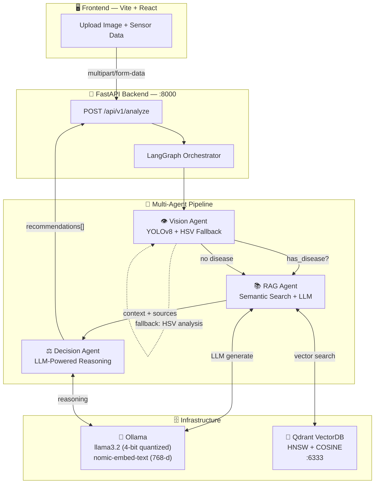
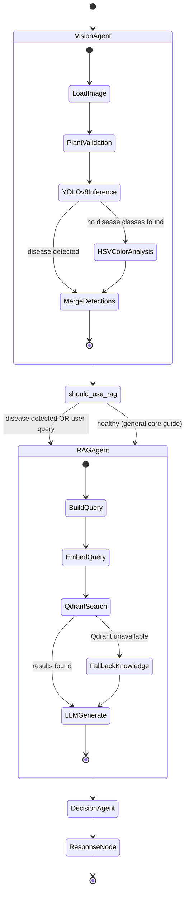
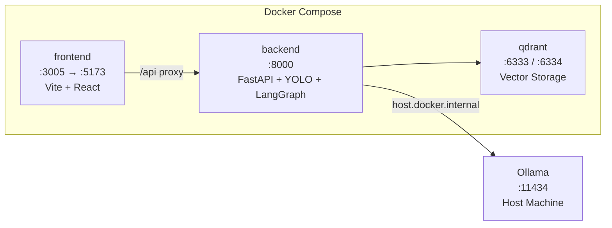

# AgroCortex 🌾 Multi-Agent Agricultural AI Platform

AgroCortex is a production-ready AI diagnostic system for hydroponic and conventional agriculture. It orchestrates multiple specialized AI agents through a **LangGraph DAG workflow**, combines **computer vision** with **retrieval-augmented generation (RAG)**, and runs entirely on **local inference** (Ollama) to ensure data privacy and zero API costs.

---

## 🏗️ System Architecture


```mermaid
graph TD
    subgraph "🖥️ Frontend — Vite + React"
        UI["Upload Image + Sensor Data"]
    end

    subgraph "📡 FastAPI Backend — :8000"
        API["POST /api/v1/analyze"]
        GRAPH["LangGraph Orchestrator"]
    end

    subgraph "🤖 Multi-Agent Pipeline"
        VA["👁️ Vision Agent<br/>YOLOv8 + HSV Fallback"]
        RA["📚 RAG Agent<br/>Semantic Search + LLM"]
        DA["⚖️ Decision Agent<br/>LLM-Powered Reasoning"]
    end

    subgraph "🗄️ Infrastructure"
        OLLAMA["🦙 Ollama<br/>llama3.2 (4-bit quantized)<br/>nomic-embed-text (768-d)"]
        QDRANT["🔷 Qdrant VectorDB<br/>HNSW + COSINE<br/>:6333"]
    end

    UI -->|"multipart/form-data"| API
    API --> GRAPH
    GRAPH --> VA
    VA -->|"has_disease?"| RA
    VA -->|"no disease"| RA
    RA -->|"context + sources"| DA
    DA -->|"recommendations[]"| API
    RA <-->|"vector search"| QDRANT
    RA <-->|"LLM generate"| OLLAMA
    DA <-->|"reasoning"| OLLAMA
    VA -.->|"fallback: HSV analysis"| VA
```

---

## 🔄 Agent Workflow (LangGraph DAG)


```mermaid
stateDiagram-v2
    [*] --> VisionAgent
    VisionAgent --> should_use_rag

    state should_use_rag <<choice>>
    should_use_rag --> RAGAgent: disease detected OR user query
    should_use_rag --> RAGAgent: healthy (general care guide)

    RAGAgent --> DecisionAgent
    DecisionAgent --> ResponseNode
    ResponseNode --> [*]

    state VisionAgent {
        [*] --> LoadImage
        LoadImage --> PlantValidation
        PlantValidation --> YOLOv8Inference
        YOLOv8Inference --> HSVColorAnalysis: no disease classes found
        YOLOv8Inference --> MergeDetections: disease detected
        HSVColorAnalysis --> MergeDetections
        MergeDetections --> [*]
    }

    state RAGAgent {
        [*] --> BuildQuery
        BuildQuery --> EmbedQuery
        EmbedQuery --> QdrantSearch
        QdrantSearch --> LLMGenerate: results found
        QdrantSearch --> FallbackKnowledge: Qdrant unavailable
        FallbackKnowledge --> LLMGenerate
        LLMGenerate --> [*]
    }
```

---

## 📊 Tech Stack

| Layer | Technology | Version | Purpose |
|-------|-----------|---------|---------|
| **Orchestration** | LangGraph | latest | DAG-based multi-agent workflow with conditional routing |
| **API** | FastAPI | 0.109 | Async REST endpoints, Pydantic validation, OpenAPI docs |
| **LLM** | Ollama (llama3.2) | — | 4-bit quantized local inference, zero external API dependency |
| **Embeddings** | nomic-embed-text | — | 768-dimensional dense vectors for semantic search |
| **Vector DB** | Qdrant | 1.7+ | Rust-based HNSW indexing, COSINE distance, metadata filtering |
| **Vision** | YOLOv8 (Ultralytics) | 8.1 | Object detection for leaf disease classification |
| **Chunking** | LangChain TextSplitter | — | RecursiveCharacterTextSplitter (1000 chars, 200 overlap) |
| **Frontend** | Vite + React + TypeScript | 6.x | Route-based lazy loading, glassmorphism UI |
| **Testing** | Vitest + RTL | — | 75+ unit/integration/e2e tests, happy-dom environment |
| **Infra** | Docker Compose | — | 3-service orchestration (backend, frontend, qdrant) |

---

## 🧩 Module Reference

### Backend Services (`backend/src/services/`)

| File | Function | Description |
|------|----------|-------------|
| `vision.py` | `analyze_image_with_yolo()` | Dual-layer detection: YOLOv8 inference → HSV color analysis fallback. Returns `detections[]` with bounding boxes, confidence scores, and source labels. |
| `vision.py` | `analyze_colors_for_disease()` | HSV-space heuristic analysis. Detects 5 anomaly types: brown spots (fungal), yellow patches (chlorosis), dark areas (necrosis), red-brown spots (bacterial), white patches (mildew). |
| `vision.py` | `is_plant()` | Pre-filter validation using green/earth-tone pixel ratio to reject non-plant images before inference. |
| `rag.py` | `add_document()` | Ingests text with automatic chunking via `RecursiveCharacterTextSplitter`. Each chunk stored as a separate vector point in Qdrant with `doc_id` and `chunk_index` metadata. |
| `rag.py` | `search_knowledge_base()` | Embeds user query → Qdrant nearest-neighbor search (COSINE) → returns top-k results. Falls back to keyword-matched `FALLBACK_KNOWLEDGE` when Qdrant is offline. |
| `rag.py` | `generate_answer()` | Constructs an LLM prompt with retrieved context chunks and generates a Markdown-formatted academic response via Ollama. |
| `rag.py` | `add_documents_bulk()` | Batch ingestion for multiple documents. Iterates `add_document()` per file with error isolation. |
| `embeddings.py` | `get_embeddings()` | Batch embedding via Ollama HTTP API (`/api/embeddings`). Produces 768-d float vectors from `nomic-embed-text`. |
| `document_loader.py` | `load_directory()` | Recursive file scanner supporting `.pdf` (pypdf), `.docx` (python-docx), `.md`, `.txt`. Returns structured `[{content, title, source}]`. |

### Agent Layer (`backend/src/agents/`)

| File | Function | Description |
|------|----------|-------------|
| `graph.py` | `create_analysis_graph()` | Compiles the LangGraph `StateGraph` with 4 nodes: vision → (conditional) rag → decision → response. |
| `graph.py` | `should_use_rag()` | Conditional edge: routes to RAG if `has_disease=True` or `query` exists. Currently always routes to RAG for comprehensive coverage. |
| `graph.py` | `run_analysis_pipeline()` | Public entry point. Creates `AgentState`, invokes compiled graph via `ainvoke()`, returns structured result dict. |
| `state.py` | `AgentState` | TypedDict defining the shared state schema across all agents: inputs (image, query, sensors), per-agent outputs, and metadata. |
| `vision_agent.py` | `vision_node()` | Calls `analyze_image_with_yolo()`, enriches detections with Turkish display names, computes `has_disease` flag. |
| `rag_agent.py` | `rag_node()` | Builds a search query from detections + sensor data, executes vector search, generates LLM-augmented academic response. |
| `decision_agent.py` | `decision_node()` | Sends detection summary + RAG context + sensor telemetry to LLM with a strict JSON output schema. Parses structured `recommendations[]`. Falls back to template-based recommendations on LLM failure. |

### API Endpoints (`backend/src/api/routes.py`)

| Method | Endpoint | Input | Output |
|--------|----------|-------|--------|
| `POST` | `/api/v1/analyze` | `multipart/form-data` (image + optional query + optional sensor JSON) | `{vision, rag, recommendations[], summary}` |
| `POST` | `/api/v1/chat` | `{message, history[]}` | `{message, sources[]}` |
| `GET` | `/api/v1/models/status` | — | `{yolo: {...}, ollama: {...}}` |
| `POST` | `/api/v1/knowledge/search` | `{query, top_k}` | `{query, results[]}` |
| `GET` | `/health` | — | `{status, timestamp}` |

---

## 🐳 Docker Deployment


```mermaid
graph LR
    subgraph "Docker Compose"
        B["backend<br/>:8000<br/>FastAPI + YOLO + LangGraph"]
        F["frontend<br/>:3005 → :5173<br/>Vite + React"]
        Q["qdrant<br/>:6333 / :6334<br/>Vector Storage"]
    end
    O["Ollama<br/>:11434<br/>Host Machine"]

    F -->|"/api proxy"| B
    B --> Q
    B -->|"host.docker.internal"| O
```

```bash
# 1. Start Ollama on host
ollama pull llama3.2 && ollama pull nomic-embed-text && ollama serve

# 2. Boot all services
docker-compose up --build -d

# 3. Ingest knowledge base (one-time)
cd backend && python3 -m src.scripts.ingest
```

| Service | URL |
|---------|-----|
| Frontend | http://localhost:3005 |
| Backend API | http://localhost:8000 |
| Swagger Docs | http://localhost:8000/docs |
| Qdrant Dashboard | http://localhost:6333/dashboard |

---

## 📂 Project Structure

```
├── backend/
│   ├── src/
│   │   ├── agents/                  # LangGraph multi-agent layer
│   │   │   ├── graph.py             # DAG workflow definition & compilation
│   │   │   ├── state.py             # Shared AgentState TypedDict
│   │   │   ├── vision_agent.py      # Image analysis node
│   │   │   ├── rag_agent.py         # Vector search + LLM generation node
│   │   │   └── decision_agent.py    # Recommendation synthesis node
│   │   ├── services/                # Core business logic
│   │   │   ├── vision.py            # YOLOv8 + HSV color analysis
│   │   │   ├── rag.py               # Qdrant search + chunking + LLM
│   │   │   ├── embeddings.py        # Ollama embedding client
│   │   │   └── document_loader.py   # Multi-format document parser
│   │   ├── api/                     # FastAPI routes + Pydantic schemas
│   │   ├── scripts/
│   │   │   ├── ingest.py            # CLI knowledge-base ingestion tool
│   │   │   └── verify_chunking.py   # Offline pipeline verification
│   │   ├── config.py                # Pydantic BaseSettings
│   │   └── main.py                  # App entrypoint + CORS + lifespan
│   ├── Dockerfile
│   └── requirements.txt
├── frontend/
│   ├── src/
│   │   ├── pages/                   # Home (analysis), Greenhouse
│   │   ├── components/              # Header, SensorPanel, ResultCards
│   │   ├── __tests__/               # 75+ Vitest + RTL tests
│   │   └── App.tsx                  # React.lazy route-based splitting
│   ├── Dockerfile
│   └── vite.config.ts
├── data/knowledge-base/             # Agricultural documents (MD, PDF, DOCX)
├── docker-compose.yml               # 3-service orchestration
└── README.md
```

---

## 🧪 Testing

```bash
cd frontend
npm run test           # Run all 75+ tests
npm run test:coverage  # Generate coverage report
npm run test:watch     # Watch mode for development
```

Test categories:
- **Unit**: Utility functions, state helpers, scoring algorithms
- **Integration**: Component rendering, API mocking, user interaction flows
- **E2E-style**: Full routing with lazy loading, Suspense boundary verification

---

## 📄 License

MIT License — 2025 AgroCortex
